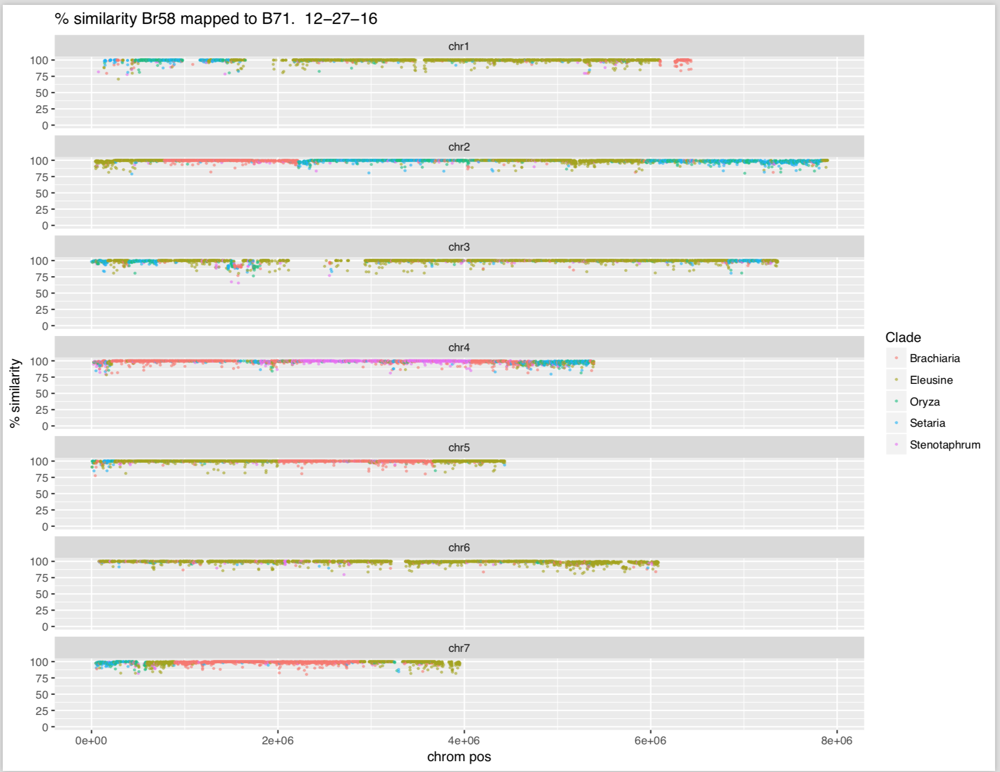

Setup:

```{r setup, include=FALSE}
'%!in%' <- function(x,y)!('%in%'(x,y))
require('dplyr')
require('knitr')
require('ggplot2')
require('RColorBrewer')

```
# Data preparation


##Generation of data

Data is generated starting with SNP reports.  Script can work either with Farman SNP-Finder, *or* MUMMER.  Below data is using SNP-finder generated reports.

* Generate reports
* Create clade list based on a master list for the SNP-report files (CreateCladeList.pm) 
* Sliding window to sum SNPs in region and calculate average/minimum for each clade (CallWindowClades.pm)

Scripts invoked to generate data:

* CreateCladeList.pm (create list of clade assignments for this specific report folder based on master)
* script0_count_length_and_masks.pl (create list of scaffold lengths given .FASTA for reference)
* CallWindowClades.pm (create window list)

#Full data

Script modified to remove unnecessary clade list generation step.  New script can be executed with the following format:

perl ../../perl/CallWindowClades_directory_no_cladelist.pm -d reports/ -p windows/

So generating a batch script that loops through each directory is easy, considering each is run with the same default options.

for d in */; do     cd "$d";     mkdir reports;     mkdir windows;     mv *_out.txt reports;     mv *_align.txt windows;     perl ../../perl/CallWindowClades_directory_no_cladelist_with_exclusion.pm -d reports/ -p windows/;     cd ..; done

## Input Data Structure

File structure:
`Strain_name/averageWindowSNPsbyClade.txt`
Each strain also has a log.txt, reports folder, and windows folder.


# Plotting the painters

```{r}
 #setwd("Users/chet/oldWork/uky/SNP_density_windows/")
myDirs = list.dirs("inputData/12-27-16_full", recursive = FALSE)
date = Sys.Date()


outPath <- paste("output/outPutPlots_" , date)
dir.create(outPath, showWarnings = FALSE)

for (thisDir in myDirs) {
  #set up directory
  FolderTrim<- gsub(".*/", "", thisDir) 
  DF <- read.table(paste(thisDir, "/averageWindowSNPsbyClade.txt", sep=""), header=TRUE, fill = TRUE)
  #transform the windows into percent snp
percentSNPs <- DF %>% group_by(Scaffold, start) %>%
  transform(adjustedminSNP= ((1000-minSNPs)/1000)*100 , AvgPercent = ((1000-avgnumSNPs)/1000*100))
toFilterStrains <- c("")
toFilterScaffolds <- c("chr1", "chr2", "chr3", "chr4", "chr5", "chr6", "chr7")
#only look in chromosomes 1-7
percentSNPsfiltered <- percentSNPs %>% group_by(Scaffold, start, Clade) %>%
  filter(Clade %!in% toFilterStrains, Scaffold %in% toFilterScaffolds)

## at this point we want to only take the "clear winners".
windowsMaxOnly<-  percentSNPsfiltered %>%group_by(Scaffold, start)%>%
  filter(adjustedminSNP == max(adjustedminSNP))

clearWinnersOnly<- windowsMaxOnly %>% group_by(Scaffold, start) %>% mutate( count=n()) %>% filter(count ==1) 

#it only counts if 800/1000 bases were aligned

clearWinnersOnly <- clearWinnersOnly %>% filter (alignedBases > 800)


pdfName<- paste(outPath, "/", FolderTrim, "_B71mapped_subset_", date, "12-27-16.pdf", sep="")
pdf(pdfName,11, 8.5)

p<- ggplot(data =  clearWinnersOnly, aes(x= start, y= adjustedminSNP, color= Clade))+facet_wrap(~Scaffold, ncol = 1)+ylab("% similarity")+xlab("chrom pos")+
   geom_point(size= .5, alpha = .5) + ggtitle(paste("% similarity", FolderTrim, "mapped to B71.   " , date))+ ylim(c(0, 100))
print(p)
 dev.off()
} 

```

Example output:

